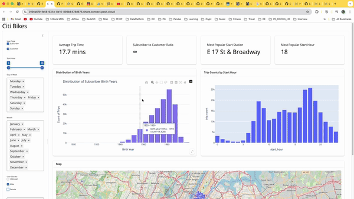

# 🚲 DSCI-532_2026_34_BikeShareOptimizer (Citi Bike Dashboard)
Welcome to the **BikeShare Optimizer Dashboard**! This dashboard is designed to provide actionable insights for urban transit planning by analyzing Citi Bike trip data. Whether you are a city planner or just curious about transit patterns, this tool helps visualize how, when, and by whom the bike-share system is used.

## 🚀 Live Dashboard
Check out the latest stable version of our app:
> **[View the Deployed Dashboard - Main](https://019ca6f9-fe48-634e-8e10-893b8478d675.share.connect.posit.cloud/)**
> **[View the Deployed Dashboard - Dev](https://019ca6f4-c5d0-3446-7380-7e1c8d3bac42.share.connect.posit.cloud/)**

## 🎥 Quick Demo
*A 15-30 second demo showing how the filters interact with the map and distribution charts.*



## 🎯 Key Features
* **Global Sidebar Filtering**: Quickly drill down into data by User Type, Birth Year, Time, Day of the Week, Month, and Gender.
* **KPI Summaries**: Instantly view Average Trip Time, Subscriber/Customer ratios, and peak station popularity.
* **Interactive Maps**: Visualize station density and usage patterns across the city using an interactive map.
* **Demographic Insights**: Explore the age distribution of our subscriber base with dynamic histogram visualizations.

## 🛠 For Contributors
If you want to run this app locally, follow these steps:

1. **Clone the repo:**
   ```bash
   git clone [https://github.com/UBC-MDS/DSCI-532_2026_34_BikeShareOptimizer.git](https://github.com/UBC-MDS/DSCI-532_2026_34_BikeShareOptimizer.git)
   cd DSCI-532_2026_34_BikeShareOptimizer```

2. **Setup your environment:**
We recommend using a virtual environment to manage dependencies.
```bash
python -m venv .venv
source .venv/bin/activate  # On Windows use: .venv\Scripts\activate
```

3. **Install dependencies:**
```
pip install -r requirements.txt
```

4. **Run the app:**
```
shiny run src/app.py
```
## 🏗 Project Structure

The project is organized to separate application logic, data assets, and technical documentation:

```text
├── data/
│   └── raw/                # Original, unaltered data (e.g., citibike-tripdata.csv)
├── img/                    # Assets for the README (e.g., demo.gif)
├── reports/
│   └── m2_spec.md          # Living technical specification & Reactivity diagrams
├── src/
│   └── app.py              # Main Shiny dashboard application
├── .gitignore              # Files to exclude from version control (e.g., .venv, __pycache__)
├── CHANGELOG.md            # Version history and milestone reflections
├── README.md               # Project documentation and setup instructions
└── requirements.txt        # Python package dependencies
```

## 🤝 Collaboration & GitHub Workflow

We maintain a structured Git workflow to ensure code quality and avoid merge conflicts. Our branch strategy is as follows:

* **`main`**: The stable production branch. This reflects the latest official release (`v0.2.0`).
* **`dev`**: The integration branch. All feature work is merged here for previewing on Posit Connect Cloud.

*Built with ❤️ by the **BikeShare Optimizer Team** (Johnson, Nishanth, Shrijaa, Zhihao) for **DSCI 532**.*