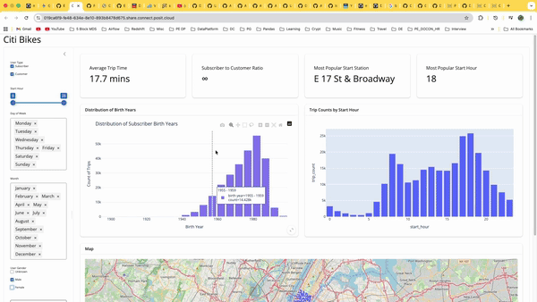

# 🚲 Citi Bike NYC System Optimizer

[](https://www.python.org/downloads/release/python-3120/)
[](https://shiny.posit.co/py/)
[](https://duckdb.org/)

## 🚀 Live Dashboard
Check out the latest stable version of our app:
- **[View the Deployed Dashboard - Main](https://019ca6f9-fe48-634e-8e10-893b8478d675.share.connect.posit.cloud/)**
- **[View the Deployed Dashboard - Dev](https://019ca6f4-c5d0-3446-7380-7e1c8d3bac42.share.connect.posit.cloud/)**

## 🎥 Quick Demo
*A 15-30 second demo showing how the filters interact with the map and distribution charts.*



## 🎯 Project Purpose & Context

Welcome to the **Citi Bike NYC System Optimizer**. This is an interactive decision-support dashboard designed for analyzing bike-share demand patterns across time and location to optimize system operations. 

**Geographic Focus:** The data focuses on a subset of Citi Bike stations concentrated in Manhattan and surrounding New York City boroughs (using June 2013 historical baseline data). 

**Use Cases & Target Audience:** This tool is built primarily for **bike-share system operators and urban transit planners** who need to answer questions such as:
* *Where should we deploy rebalancing trucks at 8:00 AM versus 5:00 PM?*
* *How do riding habits differ between annual Subscribers and casual Customers?*
* *Which stations experience the highest volume of traffic from specific demographic groups?*

By utilizing the **AI Insights Tab**, users can also bypass manual filtering entirely, using natural language to ask specific operational questions (e.g., *"Show me the distribution of female riders starting trips before 9 AM"*).

---

## ✨ Key Features

* **High-Performance Backend:** Data is stored as a highly compressed `.parquet` file and queried dynamically using **DuckDB**, ensuring rapid filtering without overloading server memory.
* **Interactive NYC Map:** A spatial view of station popularity.
* **Demographic & Temporal Analysis:** Deep dives into rider birth years, gender, and peak usage hours.
* **AI-Powered Queries:** Integrated LLM (`QueryChat`) allows operators to generate custom filtered data tables and visualizations using everyday language.

---

## 🛠 For Contributors
If you want to run this app locally, follow these steps:

1. **Clone the repo:**
   ```bash
   git clone [https://github.com/UBC-MDS/DSCI-532_2026_34_BikeShareOptimizer.git](https://github.com/UBC-MDS/DSCI-532_2026_34_BikeShareOptimizer.git)
   cd DSCI-532_2026_34_BikeShareOptimizer```

2. **Setup your environment:**
We recommend using a virtual environment to manage dependencies.
```bash
python -m venv .venv
source .venv/bin/activate  # On Windows use: .venv\Scripts\activate
```

3. **Install dependencies:**
```
pip install -r requirements.txt
```

4. **API Key Setup:**
For the AI Insights tab to work, you must create a .env file in the root directory and add your Anthropic API key:
```
ANTHROPIC_API_KEY=your_api_key_here
```

5. **4. Run the ETL Pipeline (Data Prep):**
Before launching the app, you must generate the high-performance Parquet database file. You only need to run this once.
```
python src/prep_data.py
```

6. **Run the app:**
```
shiny run src/app.py
```

## 🧪 Running Tests

This project includes automated tests to ensure dashboard functionality and prevent regressions.

We use:
- **Playwright** for end-to-end behavioral testing of the dashboard UI
- **Pytest** for unit testing core logic functions

### Install testing dependencies

```bash
pip install pytest playwright pytest-playwright
playwright install
```
### Start the dashboard locally

```bash
shiny run src/app.py
```

The dashboard will run at:

```
http://localhost:8000
```

### Run the tests

```bash
pytest tests/
```

### Included Tests

#### Behavioral Tests (Playwright)

- Verify that changing a sidebar filter updates KPI value boxes  
- Verify that the **AI Insights** tab renders the data table  
- Verify that the **Reset filter** button clears all active filters  

#### Unit Tests (Pytest)

- Tests the `calculate_avg_trip_time()` function in `src/utils.py`  
- Ensures the function returns correct values and handles empty data

## 🏗 Project Structure

The project is organized to separate application logic, data assets, and technical documentation:

```text
├── data/
│   └── raw/                # Original, unaltered data (e.g., citibike-tripdata.csv)
├── img/                    # Assets for the README (e.g., demo.gif)
├── reports/
│   └── m2_spec.md          # Living technical specification & Reactivity diagrams
├── src/
│   └── app.py              # Main Shiny dashboard application
├── .gitignore              # Files to exclude from version control (e.g., .venv, __pycache__)
├── CHANGELOG.md            # Version history and milestone reflections
├── README.md               # Project documentation and setup instructions
└── requirements.txt        # Python package dependencies
```

## 🤝 Collaboration & GitHub Workflow

We maintain a structured Git workflow to ensure code quality and avoid merge conflicts. Our branch strategy is as follows:

* **`main`**: The stable production branch. This reflects the latest official release (`v0.2.0`).
* **`dev`**: The integration branch. All feature work is merged here for previewing on Posit Connect Cloud.

*Built with ❤️ by the **Bike NYC System Optimizer Team** (Johnson, Nishanth, Shrijaa, Zhihao) for **DSCI 532**.*