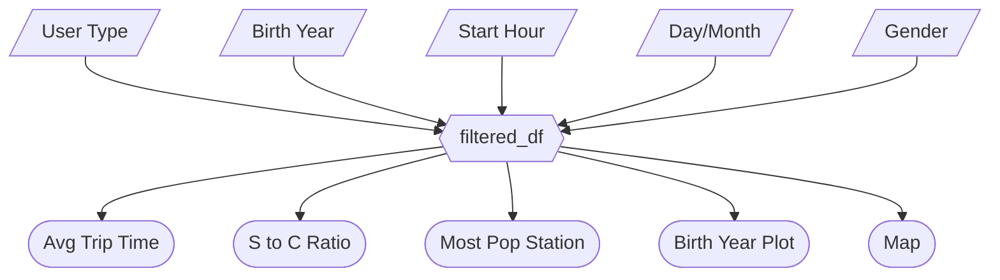

# M2 App Specification: Citi Bike Dashboard

## 2.1 Updated Job Stories

| # | Job Story | Status | Notes |
| :--- | :--- | :--- | :--- |
| 1 | When I analyze Citi Bike data, I want to filter by user type and time, so I can see usage patterns for Subscribers vs Customers. | ✅ Implemented | Sidebar filter setup complete. |
| 2 | When I am a city planner, I want to filter by user demographics (age/gender), so I can see who is using the service. | ✅ Implemented | Added sliders/checkboxes for demographics. |
| 3 | When I am exploring station usage, I want to see the geographic map, so I can identify high-traffic areas. | ✅ Implemented | Map added. |
| 4 | When I analyze Citi Bike data, I want to analyze the Distribution of Birth Years of our subscribers, so I can see their usage patterns. | ✅ Implemented | Distribution of Birth Years component added. |

## 2.2 Component Inventory

| ID | Type | Shiny widget / renderer | Depends on | Job story |
| :--- | :--- | :--- | :--- | :--- |
| `usertype_checkbox` | Input | `ui.input_checkbox_group()` | — | #1 |
| `birth_year_slider` | Input | `ui.input_slider()` | `usertype_checkbox` | #2 |
| `start_time_slider` | Input | `ui.input_slider()` | — | #1 |
| `day_of_week_filter`| Input | `ui.input_selectize()` | — | #1 |
| `month_filter` | Input | `ui.input_selectize()` | — | #1 |
| `gender_checkbox` | Input | `ui.input_checkbox_group()` | — | #2 |
| `filtered_df` | Reactive calc | `@reactive.calc` | All Inputs | #1, #2, #3 |
| `avg_trip_time` | Output | `@render.text` | `filtered_df` | #1 |
| `s_to_c_ratio` | Output | `@render.text` | `filtered_df` | #1 |
| `pop_start_id` | Output | `@render.text` | `filtered_df` | #3 |
| `barplot1` | Output | `output_widget` | `filtered_df` | #4 |
| `map` | Output | `output_widget` | `filtered_df` | #4 |

## 2.3 Reactivity Diagram

## 2.4 Calculation Details

* **`filtered_df` (@reactive.calc)**:
    * **Dependencies**: All sidebar inputs (`usertype_checkbox`, `birth_year_slider`, `start_time_slider`, `day_of_week_filter`, `month_filter`, `gender_checkbox`).
    * **Transformation**: Performs a boolean mask on the primary DataFrame. It includes specific conditional logic: if "Customer" is excluded from `usertype_checkbox`, the `birth_year_slider` filter is applied to the result set. It returns the subsetted DataFrame.
    * **Outputs**: This calculation is consumed by all summary value boxes (`avg_trip_time`, `s_to_c_ratio`, `pop_start_id`) and all interactive plot/map outputs (`barplot1`, `map`).

## Reflection/Notes

* **Performance Note**: To ensure the map and bar charts perform well, the map component aggregates data using `.groupby()` on station names. This prevents the browser from attempting to render thousands of individual data points simultaneously.
* **Pending Work**: The `pop_start_hour` calculation is currently a placeholder and will be completed in M3 to perform the necessary frequency distribution calculation.

