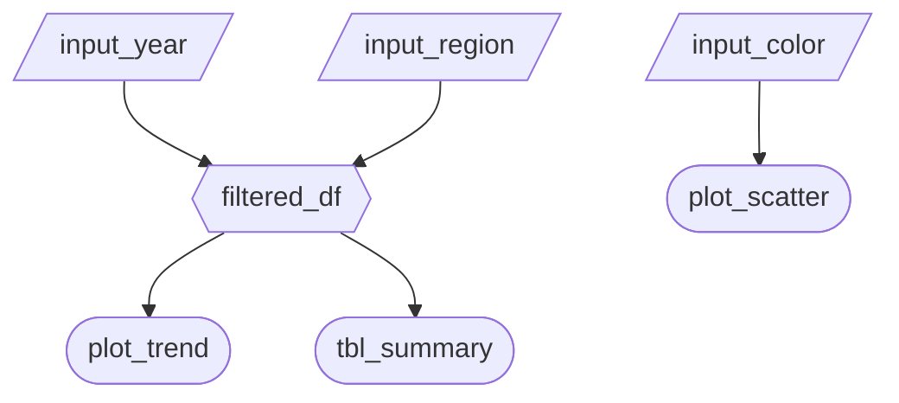

# Milestone 2 - Dashboard Prototype

In this milestone, you will build a working prototype of your Shiny dashboard and deploy it publicly on [Posit Connect Cloud](https://connect.posit.cloud/). Your starting point is the skeleton app from M1 Phase 3 — expand it into a functional prototype that implements your proposal.

**Before starting, re-read the [General Project Guidelines](../milestone1/general_guidelines.md).** Submission, versioning, and GitHub workflow requirements are the same throughout the course.

## Deliverables Checklist

- [ ] **App Specification**: `reports/m2_spec.md` completed.
- [ ] **Deployment Setup**: Deployment to Posit Connect Cloud is set up on both `main` (stable, no autoupdate) and `dev` (preview) branches.
- [ ] **Dev Branch Previews**: At least 3 feature-branch PRs merged into `dev` during this milestone, updating posit cloud connect preview.
- [ ] **Working App**: Functional prototype deployed; both URLs added to repo "About" section.
- [ ] **CHANGELOG**: `CHANGELOG.md` updated with `[0.2.0]` entry (Added/Changed/Fixed/Known Issues/Reflection).
- [ ] **README and Demo**: Updated README with embedded demo animation and deployed link.
- [ ] **Release v0.2.0**: Created on GitHub with release notes.
- [ ] **Gradescope Submission**: PDF with link to release submitted.
- [ ] **Deployment**: Posit Connect Cloud main deployment reflects the release state before deadline.

---

## Phase 1: Setting Up Dashboard Deployment (Posit Connect Cloud)

You will run **two separate deployments** of your app on Posit Connect Cloud — a stable release build and a live preview build. Set both up using your **layout-only skeleton app** (from M1 Phase 3) before building out functionality. This surfaces any platform issues early and gives you a clean workflow for the rest of the milestone.

Follow the [course deployment guide](https://ubc-mds.github.io/DSCI_532_vis-2_book/020-publish.html) alongside the steps below.

1. Confirm your skeleton runs locally: `shiny run src/app.py`
2. Create a `dev` branch in your repository (branched from `main`): `git checkout -b dev`
3. Create `requirements.txt` for all packages your app needs (ideally with **pinned versions**).
   - You can use the book `requirements.txt` or `pip list --format freeze > requirements.txt` as a starting point, but make sure remove packages not needed to run the app.
   - Do **not** include packages unrelated to running the app (e.g., build tools, Jupyter).
4. Sign up at [connect.posit.cloud](https://connect.posit.cloud/) and connect your GitHub account.

### 1.2 Deploy: Stable Build (`main`)

This is the version TAs grade. It only updates when you deliberately trigger a republish.

5. Click **Publish** → **Shiny** → select your repo → select `main` branch → select `src/app.py` → **Publish**.
6. **Immediately disable "Automatically publish on push"** in Content Settings.
7. Verify the URL opens and the layout renders correctly.

**For your graded release:** after creating your v0.2.0 GitHub release, go to this deployment's Content page on Connect Cloud and click **Republish** once. This syncs the deployed app to your release commit. Updating after the submission deadline will result in a late penalty.

### 1.3 Deploy: Preview Build (`dev`)

This is your team's live preview — it rebuilds automatically on every push to `dev`, so anyone can see the latest state of the app without running it locally.

8. Click **Publish** → **Shiny** → select your repo → select `dev` branch → select `src/app.py` → **Publish**.
9. Leave **"Automatically publish on push" enabled** for this deployment.
10. Verify the preview URL opens.

**Development workflow:** all feature work happens on short-lived feature branches (e.g., `feat/filter-widget`). Merge feature branches into `dev` via PR for preview, then merge `dev` into `main` for your milestone release.

You must have **at least 3 feature-branch → `dev` PR merges** during this milestone visible in your repo's PR history.

### 1.4 Post-Setup Housekeeping

11. Update the **About** panel of your GitHub repo (gear icon, top-right of the repo home page):
    - A one-sentence description in the **Description** field.
    - The **stable (`main`) deployed URL** in the **Website** field.
    - 3–5 topic keywords (e.g., `shiny`, `altair`, `slider`, `dropdown`, `map`).
12. Add both URLs (stable and preview) to your README.

> **Tip:** redeploy the stable build periodically during development — especially after adding new package dependencies to `requirements.txt`. Don't wait until the last night.

---

## Phase 2: App Specification (`reports/m2_spec.md`)

Before writing code, create `reports/m2_spec.md` to plan your implementation. This is a **living specification** — you will update it in M3 and M4 as your app evolves. It must contain the four sections below.

### 2.1 Updated Job Stories

Review your M1 job stories in light of your deployment setup and any new insights. Update or add stories as needed, and track their status:

| #   | Job Story                       | Status       | Notes                         |
| --- | ------------------------------- |--------------| ----------------------------- |
| 1   | I want to **identify stations with the highest departures during rush hour** so that I can **prioritize redistribution**|  |                               |
| 2   | I want to **compare weekday and weekend demand** so that I can **adjust staffing schedules** |              |  |
| 3   | I want to **analyze monthly usage trends** so that I can **evaluate whether the system requires expansion** |  |                               |

### 2.2 Component Inventory

Plan every input, reactive calc, and output your app will have. Use this as a checklist during Phase 3. Minimum **2 components per team member** (6 for a 3-person team, 8 for a 4-person team), with **at least 2 inputs and 2 outputs**:

| ID            | Type          | Shiny widget / renderer | Depends on                   | Job story  |
| ------------- | ------------- | ----------------------- | ---------------------------- | ---------- |
| `input_year`  | Input         | `ui.input_slider()`     | —                            | #1, #2     |
| `filtered_df` | Reactive calc | `@reactive.calc`        | `input_year`, `input_region` | #1, #2, #3 |
| `plot_trend`  | Output        | `@render.plot`          | `filtered_df`                | #1         |
| `tbl_summary` | Output        | `@render.data_frame`    | `filtered_df`                | #2         |

### 2.3 Reactivity Diagram

Draw your planned reactive graph as a [Mermaid](https://mermaid.js.org/) flowchart using the notation from Lecture 3:

- `[/Input/]` (Parallelogram) (or `[Input]` Rectangle) = reactive input
- Hexagon `{{Name}}` = `@reactive.calc` expression
- Stadium `([Name])` (or Circle) = rendered output

Example:

````markdown

````

Verify your diagram satisfies the reactivity requirements in Phase 3.2 before you start coding.

### 2.4 Calculation Details

For each `@reactive.calc` in your diagram, briefly describe:

- Which inputs it depends on.
- What transformation it performs (e.g., "filters rows to the selected year range and region(s)").
- Which outputs consume it.

---

## Phase 3: App Development

### 3.1 App Design and Functionality

Building on your M1 skeleton and proposal sketch, implement a functional dashboard prototype. Deviations from your original sketch are acceptable: document them under `### Changed` in your `CHANGELOG.md`.

**Layout and structure:**

- Use [Shiny's grid layout system](https://shiny.posit.co/py/layouts/).
- A sidebar holding all global filter widgets is a sensible default for most dashboards (see the Lecture 2 case study).
- Refer to [Shiny templates](https://shiny.posit.co/py/templates/) for good starting points and best practices.
- Refer to [Shiny layouts](https://shiny.posit.co/py/layouts/) and [components](https://shiny.posit.co/py/components/) docs.

For altair component page docs, please use this [deployment preview URL](https://pr-326--pyshiny.netlify.app/)
which comes from this [PR](https://github.com/posit-dev/py-shiny-site/pull/326)

**Design principles** (from Lecture 2 — _Designing Effective Dashboards_):

1. **Be concise** — show only what serves your users' job stories. Apply the 5-second rule: the key message should be clear immediately.
2. **Layout logically** — most important content top-left; keep widgets visually close to the charts they control.
3. **Include context** — use [`ui.value_box()`](https://shiny.posit.co/py/components/) for KPI summaries; give numbers units, labels, and comparisons (e.g., "↑ 12% vs last month").
4. **Mind the details** — use colorblind-friendly palettes; make active filter state visible; include a footer with app description, authors, repo link, and last updated date.

**Component requirements:**

- Implement all components planned in your Phase 2 spec (minimum 2 per team member, at least 2 inputs and 2 outputs).
- Every output must respond to at least one reactive input or `@reactive.calc` — no static outputs.
- TAs will grade your deployed app in a full-screen browser window.

**Visualizations:**

- Follow DSCI 531 best practices, or clearly document in `CHANGELOG.md` (`### Reflection`) why you deviated.

### 3.2 Reactivity Architecture

Your app must implement a sound reactive design as taught in Lectures 3 and 4. Specifically:

- **At least one `@reactive.calc`** that depends on **two or more inputs** (e.g., multiple filters for dataset).
- **At least two outputs** must consume that same `@reactive.calc`. Each input change triggers the calculation once, not once per output.
- **All remaining outputs** must depend on at least one reactive input — every output must respond to the user.

Your reactivity diagram and component inventory from Phase 2 are your implementation guide.

---

## Phase 4: Documentation

### 4.1 CHANGELOG and Reflection

Append a `## [0.2.0]` entry to `CHANGELOG.md` at the root of your repository following the [CHANGELOG and Reflection Guidelines](../milestone1/general_guidelines.md#3-changelog-and-reflection-milestones-24) in the General Guidelines.

In addition to the standard sections (`Added`, `Changed`, `Fixed`, `Known Issues`) in your `Reflection` section make sure to addresses:

- Which job stories from your spec are now fully implemented, partially done, or pending M3.
- How your final layout compares to your M1 sketch and M2 spec -- if it changed, update the spec and note it under `### Changed`.

### 4.2 README and Demo

**4.2.1 Demo animation:**

Record a 15–30 second demo of your working app showing at least one full interaction cycle (change a widget → see outputs update). Save as `img/demo.gif` (or `img/demo.mp4`) and embed it in your README.

If you don't have a tool in mind, you can use [ezgif.com/video-to-gif](https://ezgif.com/video-to-gif) to convert any screen recording to GIF online (good fallback for any OS).

**4.2.2 README update:**

Expand your README to serve two audiences:

1. **Users** — motivation, what the dashboard solves, the deployed link, and the embedded demo animation.
2. **Contributors** — how to install dependencies and run the app locally; a link to `CONTRIBUTING.md`.

---

## Optional: Complexity Enhancement

Implement **one** of the following and add a "Complexity Enhancement" section to your `reports/m2_spec.md` — describe what you added and why it improves the user experience:

- **Reset button** — use `@reactive.event(input.reset_btn)` with `@reactive.effect` to restore all widgets to their defaults ([`reactive.event` docs](https://shiny.posit.co/py/api/core/reactive.event.html)).
- **Table row selection driving charts** — use `render.DataGrid(selection_mode="rows")` and `table.data_view(selected=True)` in a `@reactive.calc` that feeds one or more plot outputs ([`render.data_frame` docs](https://shiny.posit.co/py/api/core/render.data_frame.html)).
- **Multi-page layout** — organize views for different user tasks using `ui.navset_bar()` and `ui.nav_panel()` ([`ui.nav_panel` docs](https://shiny.posit.co/py/api/core/ui.nav_panel.html)).

---

## Submission & Collaboration

Follow the [General Guidelines](../milestone1/general_guidelines.md#1-submission-instructions) to create your v0.2.0 release and submit to Gradescope.

_The `accuracy` points here are assessed on your GitHub workflow: feature branches, atomic commits, PR reviews — see [General Guidelines §2](../milestone1/general_guidelines.md#2-collaboration--github-workflow)._

### Deliverables Checklist

- [ ] **App Specification**: `reports/m2_spec.md` completed.
- [ ] **Deployment Setup**: Deployment to Posit Connect Cloud is set up on both `main` (stable, no autoupdate) and `dev` (preview) branches.
- [ ] **Dev Branch Previews**: At least 3 feature-branch PRs merged into `dev` during this milestone, updating posit cloud connect preview.
- [ ] **Working App**: Functional prototype deployed; both URLs added to repo "About" section.
- [ ] **CHANGELOG**: `CHANGELOG.md` updated with `[0.2.0]` entry (Added/Changed/Fixed/Known Issues/Reflection).
- [ ] **README and Demo**: Updated README with embedded demo animation and deployed link.
- [ ] **Release v0.2.0**: Created on GitHub with release notes.
- [ ] **Gradescope Submission**: PDF with link to release submitted.
- [ ] **Deployment**: Posit Connect Cloud main deployment reflects the release state before deadline.
